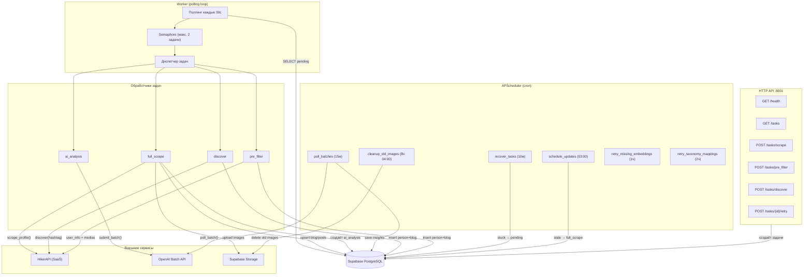
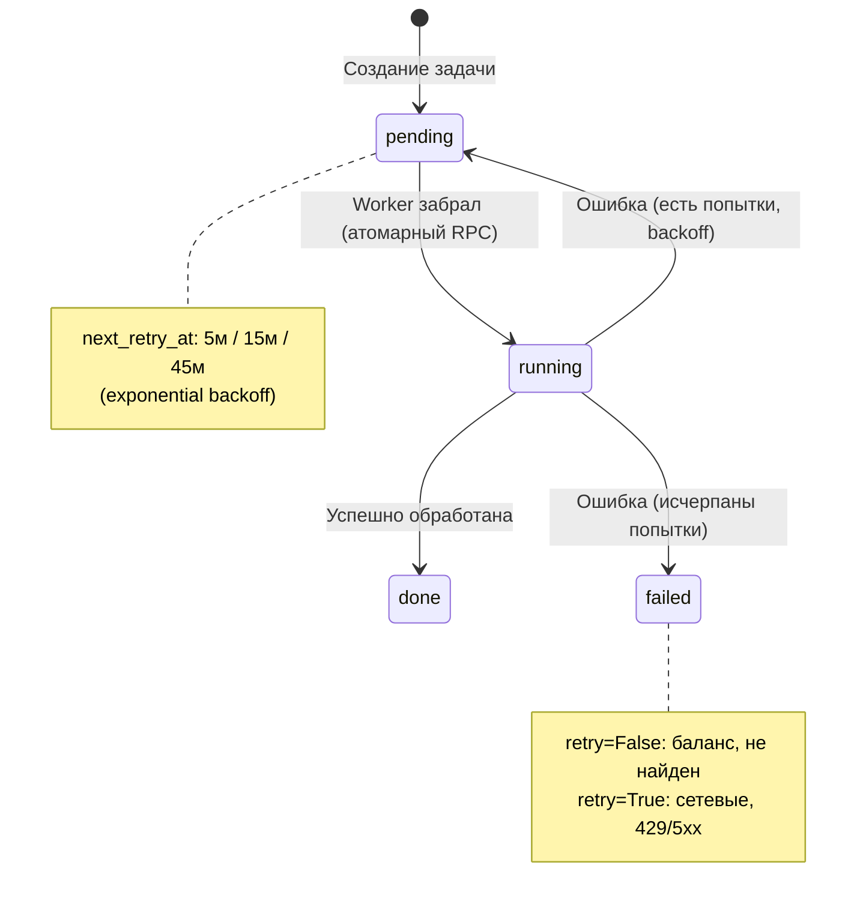
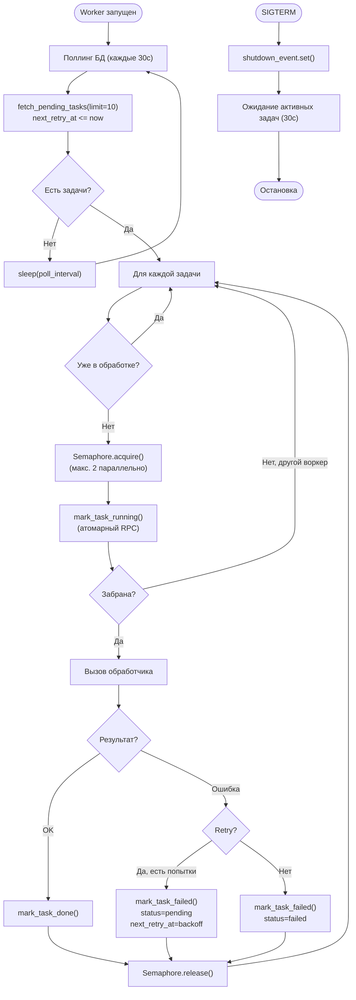
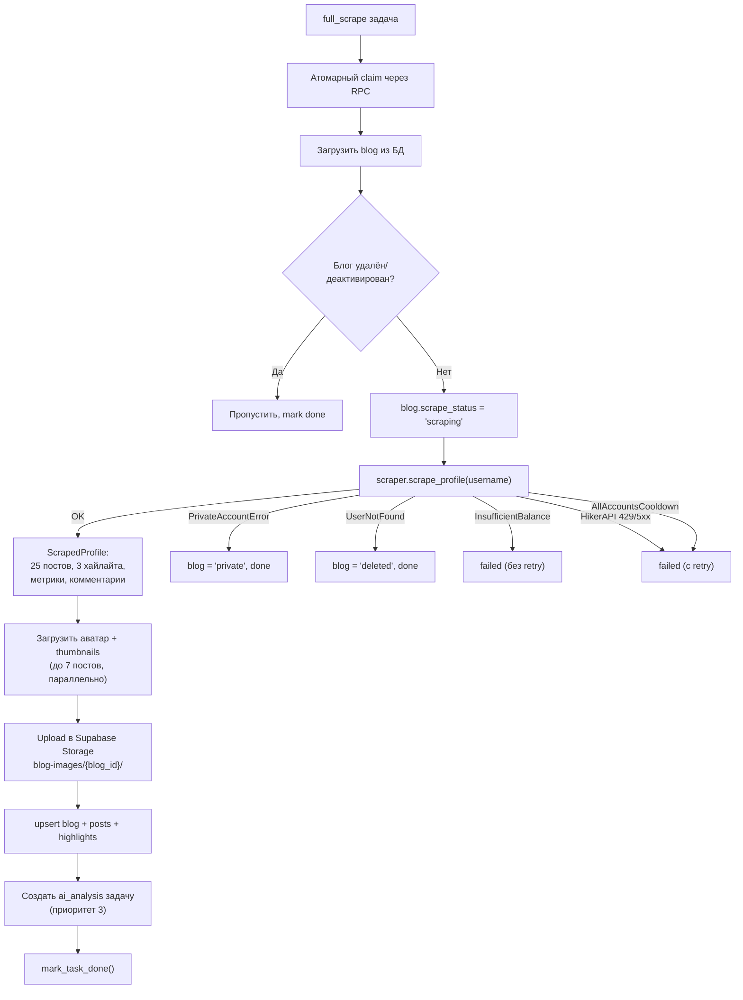
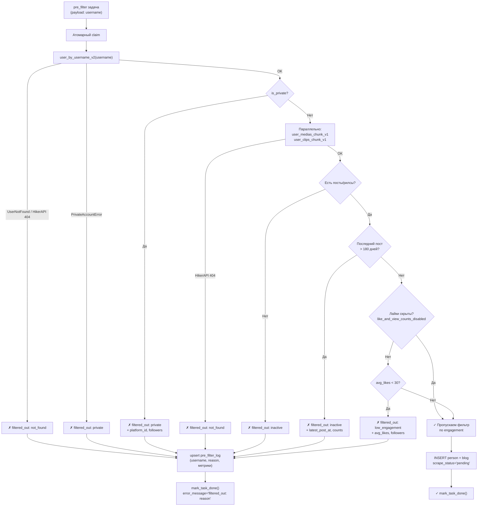
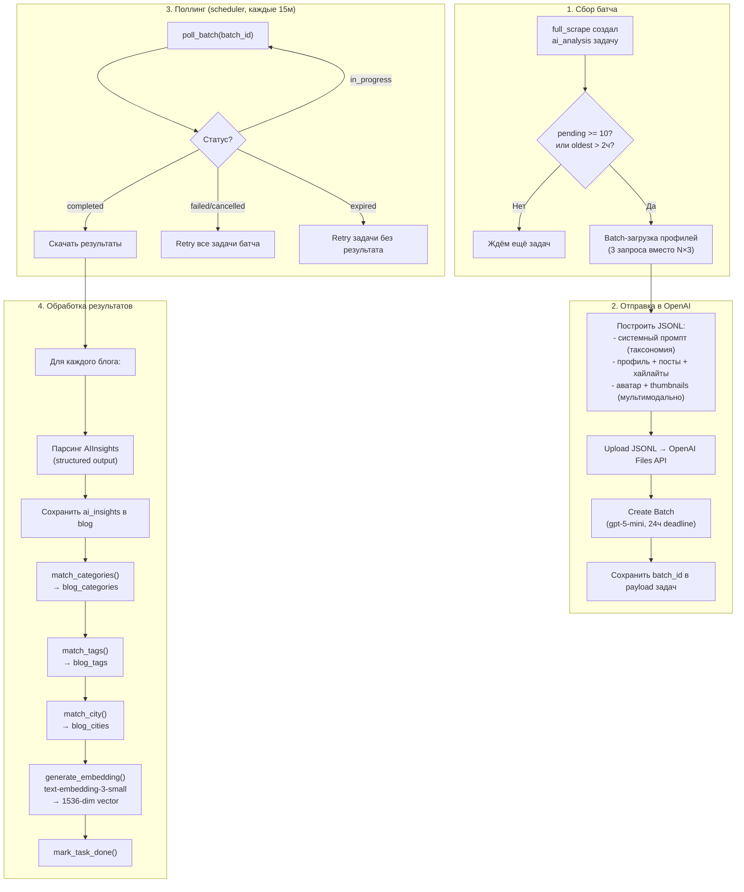
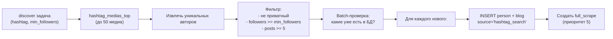
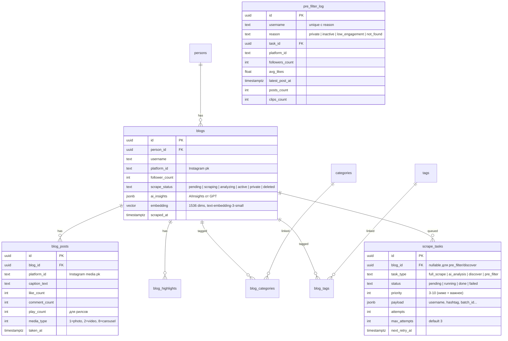
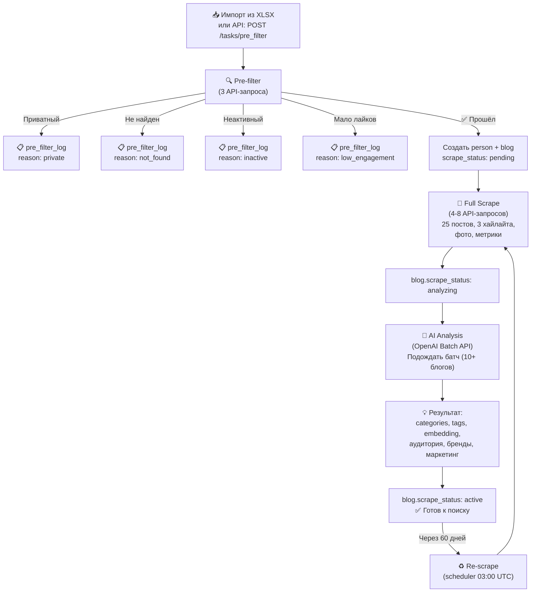

# Scraper — обзор системы

Автономный Python-сервис для сбора и AI-анализа Instagram-профилей блогеров.

---

## Общая архитектура



---

## Жизненный цикл задачи



| Статус | Описание |
|--------|----------|
| `pending` | Ожидает обработки. Если `next_retry_at` заполнен — ждёт время ретрая |
| `running` | Забрана воркером, в процессе |
| `done` | Завершена успешно (или filtered_out для pre_filter) |
| `failed` | Ошибка, все попытки исчерпаны |

---

## Типы задач

| Тип | Приоритет | Создаётся | Что делает | Результат |
|-----|-----------|-----------|------------|-----------|
| `pre_filter` | 8 | API, xlsx-импорт | Быстрая проверка: приватный? активный? лайки? | person + blog или filtered_out в pre_filter_log |
| `full_scrape` | 3-8 | API, discover, scheduler | Полный скрейп: 25 постов, 3 хайлайта, метрики, фото | Данные в blogs/posts/highlights + ai_analysis задача |
| `ai_analysis` | 3 | full_scrape handler | AI-анализ через OpenAI Batch API | ai_insights, категории, теги, embedding |
| `discover` | 10 | API | Поиск блогеров по хештегу | Новые person + blog + full_scrape задачи |

---

## Worker — цикл обработки



---

## Full Scrape — подробный поток



### Что скрейпится

| Данные | Количество | Источник |
|--------|-----------|----------|
| Профиль | 1 | `user_by_username_v2` |
| Посты + рилсы | до 25 | `user_medias_chunk_v1` |
| Рилсы | до 25 | `user_clips_chunk_v1` |
| Хайлайты | до 3 | `user_highlights`, `highlight_medias` |
| Комментарии | до 10 на 3 поста | `media_comments` |
| Аватар | 1 | URL из профиля |
| Thumbnails | до 7 | URL из постов |

---

## Pre-filter — быстрая проверка



---

## AI-анализ — пайплайн



### Что анализирует AI

| Блок | Поля | Описание |
|------|------|----------|
| **Профиль** | page_type, profession, city, country, confidence | Тип страницы, профессия, геолокация |
| **Жизненная ситуация** | children, relationship, young_parent | Семейное положение |
| **Стиль жизни** | car, travel, pets, real_estate, lifestyle_level | Уровень жизни (1-5) |
| **Контент** | categories, subcategories, tags, language, tone, quality | Тематика, стиль, качество |
| **Аудитория** | gender_distribution, age_distribution, geo_distribution | Демография (%) |
| **Коммерция** | detected_brands, ambassador_brands, brand_safety | Бренды и безопасность |
| **Маркетинг** | best_fit_industries, not_suitable_for, collaboration_risk | Рекомендации для рекламодателей |

### Embedding — что кодируется в вектор

```
Краткое описание → категории → профессия → город →
теги → аудитория (пол/возраст/гео) → маркетинговая ценность →
качество engagement → brand safety → стиль жизни → риски
```

Используется для семантического поиска: `pgvector` в PostgreSQL, cosine similarity.

---

## Discover — поиск блогеров



---

## HTTP API

### Эндпоинты

| Метод | Путь | Auth | Описание | Ответ |
|-------|------|------|----------|-------|
| `GET` | `/api/health` | Нет | Healthcheck: аккаунты, счётчики задач | 200 |
| `GET` | `/api/tasks` | Да | Список задач (фильтры: status, task_type, limit, offset) | 200 |
| `GET` | `/api/tasks/{id}` | Да | Статус конкретной задачи | 200 / 404 |
| `POST` | `/api/tasks/scrape` | Да | Создать full_scrape (до 100 username) | 201 / 207 |
| `POST` | `/api/tasks/pre_filter` | Да | Создать pre_filter (до 100 username) | 201 / 207 |
| `POST` | `/api/tasks/discover` | Да | Создать discover по хештегу | 201 |
| `POST` | `/api/tasks/{id}/retry` | Да | Повторить failed задачу | 200 / 404 / 409 |

- **Auth**: `Authorization: Bearer <SCRAPER_API_KEY>` (constant-time сравнение)
- **Rate limit**: 60 req/мин per IP
- **207 Multi-Status**: Часть username обработана, часть с ошибками
- **Guard**: `is_blog_fresh()` — не создавать задачу если блог скрапили < 60 дней назад

---

## Scheduler — cron-задачи

| Задача | Расписание | Что делает |
|--------|-----------|------------|
| `poll_batches` | Каждые 15 мин | Проверяет статус OpenAI батчей, обрабатывает результаты |
| `recover_tasks` | Каждые 10 мин | Зависшие задачи (running > 30м / 2ч для AI) → pending |
| `retry_stale_batches` | Каждые 2 часа | Батчи > 4ч → retry (последняя мера после recover) |
| `retry_missing_embeddings` | Каждые 1 час | Генерация embedding для блогов без вектора |
| `retry_taxonomy_mappings` | Каждые 2 часа | Повторный матчинг категорий/тегов |
| `audit_taxonomy_drift` | Ежедневно 05:00 UTC | Аудит: промпт ↔ БД таксономия (расхождения → warning) |
| `schedule_updates` | Ежедневно 03:00 UTC | Re-scrape: блоги `active` + `scraped_at > 60д` → full_scrape (до 100, по followers DESC) |
| `cleanup_old_images` | Воскресенье 04:00 UTC | Удаление старых изображений из Storage |

---

## База данных

### Таблицы



### Ключевые индексы

| Индекс | Таблица | Назначение |
|--------|---------|-----------|
| `idx_scrape_tasks_active_pre_filter_username` | scrape_tasks | Дедупликация active pre_filter задач по username |
| `idx_pre_filter_log_username_reason` | pre_filter_log | Unique: один username+reason (upsert при повторном прогоне) |

---

## Обработка ошибок

### Стратегия retry

| Ошибка | Retry? | Backoff | Комментарий |
|--------|--------|---------|-------------|
| Сетевая ошибка (timeout, connection) | Да | 5м → 15м → 45м | Транзиентная, пройдёт |
| HikerAPI 429 (rate limit) | Да | 5м → 15м → 45м | Нужно подождать |
| HikerAPI 5xx (server error) | Да | 5м → 15м → 45м | Серверная проблема |
| AllAccountsCooldownError | Да | 5м → 15м → 45м | Все аккаунты в кулдауне |
| HikerAPI 402 (InsufficientBalance) | **Нет** | — | Баланс исчерпан |
| HikerAPI 404 (not found) | **Нет** | — | Аккаунт не существует |
| UserNotFound | **Нет** | — | Аккаунт не найден |
| PrivateAccountError | **Нет** | — | Приватный аккаунт |
| OpenAI batch failed | Да | Повтор батча | Весь батч ретраится |

### Graceful degradation

- Ошибка загрузки изображений → продолжить без фото
- Ошибка taxonomy matching → сохранить insights, залогировать
- Ошибка embedding → продолжить (поиск будет без этого блога)
- Ошибка одного блога в батче → не блокирует остальные

---

## Конфигурация

### Основные параметры

| Параметр | Default | Описание |
|----------|---------|----------|
| `WORKER_POLL_INTERVAL` | 30с | Интервал поллинга задач |
| `WORKER_MAX_CONCURRENT` | 2 | Максимум параллельных задач |
| `POSTS_TO_FETCH` | 25 | Постов/рилсов при скрейпе |
| `HIGHLIGHTS_TO_FETCH` | 3 | Хайлайтов при скрейпе |
| `THUMBNAILS_TO_PERSIST` | 7 | Thumbnails для сохранения |
| `BATCH_MIN_SIZE` | 10 | Мин. размер AI-батча |
| `BATCH_MODEL` | gpt-5-mini | Модель для AI-анализа |
| `PRE_FILTER_MIN_LIKES` | 30 | Порог avg likes |
| `PRE_FILTER_MAX_INACTIVE_DAYS` | 180 | Макс. дней неактивности |
| `PRE_FILTER_POSTS_TO_CHECK` | 5 | Постов для проверки engagement |
| `RESCRAPE_DAYS` | 60 | Дней до re-scrape |
| `SCRAPER_BACKEND` | instagrapi | `instagrapi` или `hikerapi` |

### HikerAPI запросы на 1 блогера

| Этап | Запросов | Endpoint |
|------|---------|----------|
| Pre-filter | 1-3 | user_info + medias + clips |
| Full scrape | 4-8 | user_info + medias + clips + highlights + comments |
| Discover | 1 + N | hashtag_medias + user_info × N |

---

## Полный путь блогера через систему


